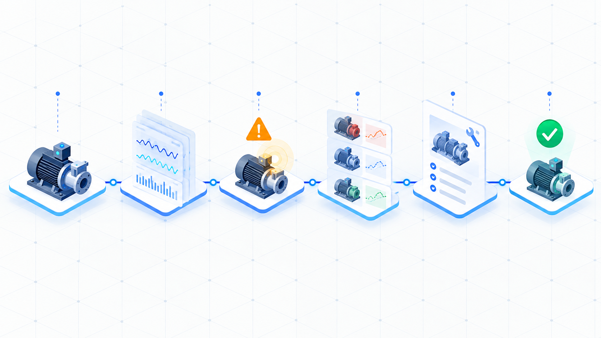

## 現場の記録は、あるのに使えない

設備の履歴、写真、点検メモ、過去の判断、未完了のタスク。それぞれは保存されていても、次の作業の場面ではつながっていないことがあります。

「この設備は前にも同じ症状があったか」「対応を急ぐ根拠はあるか」「保存してよい内容か」を確認するたびに、複数の記録を読み直し、転記し、担当者が判断します。

Connect-Forceは、その確認を一つの作業体験へ寄せるための業務AIエージェントです。

## 体験の中心は「過去・現在・未来・行動」

Connect-Forceは、設備IDを起点に次の順序で情報を扱います。

1. 過去: その設備に紐づく履歴を、根拠のファイル名と行番号付きで表示する
2. 現在: 再故障、期限超過、矛盾、記録不足を「要確認」として示す
3. 未来: 根拠が十分な場合だけ、点検、修理評価、条件付き監視の選択肢を比較する
4. 行動: 確認・引継ぎの下書きを提示し、利用者が承認した場合だけ保存する

この流れは、将来を断定する予測AIではありません。事実、推測、未確認を混ぜずに、次に確認すべきことを整理する設計です。

## 創作上の比喩を、業務上の制御へ翻訳する

「フォース・ビジョン」「サイコメトリー」「ポートキー」などの名称は、ハッカソンで体験を説明しやすくするための比喩です。実装では、次のように現実の業務制御へ置き換えています。

| 比喩 | 業務上の意味 |
| --- | --- |
| フォース・ビジョン | 複数の条件付きシナリオ比較 |
| フォース・センス | 再発、期限、矛盾、危険語の検知 |
| サイコメトリー | 設備IDに紐づく履歴の再構成 |
| 組分け帽子 | 依頼の目的と危険度に応じたルーティング |
| 必要の部屋 | 案件ごとの最小権限ワークスペース |
| 忍びの地図 | 根拠、警告、状態、承認待ちの可視化 |
| フォース・プッシュ | 副作用を伴う作業を下書きに留める制御 |
| ポートキー | 短時間・一回限り・同一利用者限定の移動 |

大切なのは、AIの能力を強く見せることではなく、AIが何を根拠にし、どこで止まるかを利用者が理解できることです。

## 自律性は、勝手に実行することではない

Connect-Forceは、依頼を受け取ると、まず入力形式、認証、対象ID、権限、パスをコードで検査します。次に、目的と危険度を分類し、必要な履歴だけを読みます。

根拠が不足している場合、矛盾や危険な条件が見つかった場合、予算条件を満たせない場合は、比較や保存へ進みません。質問、読取り専用、拒否のいずれかへ切り替えます。

書き込みが必要なときは、利用者の承認を待ちます。保存前には根拠が変わっていないかを確認し、同じ`operationId`の再送で二重保存しないようにしています。

## 音声を扱う境界

会話の内容は、確認・匿名化した文字起こしとして扱うのが基本です。ブラウザの音声認識やAqua Voiceで入力した文章も、利用者が確認チェックを付けない限りMissionには渡しません。

一方、利用者が短い音声そのものをORCA ROUTERで分析したい場面もあります。そこで任意の限定経路を追加しました。送信のたびに確認し、最大30秒、3.9MB以下、マイク入力だけを固定したORCA ROUTER APIへ送ります。スピーカーや他アプリの通話音声は取得しません。

音声データとAPIの生応答は、そのリクエスト処理中だけで扱います。作業室、判断マップ、下書き、監査記録、ログへ保存しません。返った要約もMissionへ自動で入れず、利用者が内容を確認・匿名化して文字起こし欄へ入力した場合だけ、既存の承認フローで使えます。

この経路は「音声を送れる」ことを売りにするための機能ではありません。送信範囲と停止条件を明示し、音声が業務判断を勝手に変えないようにするための設計です。

## PC版とEve会話の役割

PC版は、ハッカソンのデモで安全に体験してもらう入口です。既定分析は決定的なルール処理で行い、外部LLMを呼びません。合成デモでは、4件の履歴から再故障と期限超過を検知し、3つの条件付きシナリオと根拠を表示できます。明示承認した短いマイク音声のORCA分析は、基本フローと分離した任意機能です。

Eve会話は、自然言語から必要なToolを選ぶ入口です。ORCA ROUTERまたはClaudeを、依頼の目的と安全条件に合わせて選択します。APIキーはモデル設定へ永続化せず、ワークフローのシリアライズ結果にも含めません。

外部LLMを使う経路では、送信対象を限定し、匿名化した情報だけを扱います。PC版の通常分析はルール処理で完結するため、外部モデルを呼びません。

## どこまで検証できたか

2026年9月21日の検証では、43件の単体・HTTP統合テスト、型検査、Eve構成検査、本番ビルド、秘密情報スキャンが成功しました。PC画面では、認証、分析、根拠表示、承認保存、一回限りの移動リンク、音声分析UIを確認しています。

ORCA ROUTERの実環境E2Eでは、27.684秒の音声を3回連続で処理し、すべてHTTP 200で完了しました。各回は766入力token・60出力tokenで、公開単価に基づく合計見積は$0.0011394です。デモ用の上限は$2以内に固定しています。

音声分析では、未承認、30秒超過、形式不正の入力を拒否します。サーバーが実デコードで時間を計測し、音声バイト列とAPIの生応答を作業室、判断マップ、下書き、監査記録、ログへ保存しません。

## デモで体験する流れ

デモでは、設備IDから作業室を開き、根拠と警告を確認し、対応案を比較してから下書きを承認します。任意の音声分析では、明示送信、30秒上限、サーバー実デコード、ORCA ROUTERとのE2Eを確認できます。

Connect-Forceは、根拠と承認を残しながら、現場と組織の記憶を次の業務へつなぐ作業室です。
