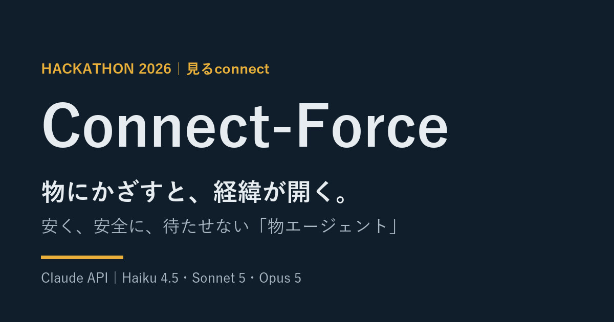
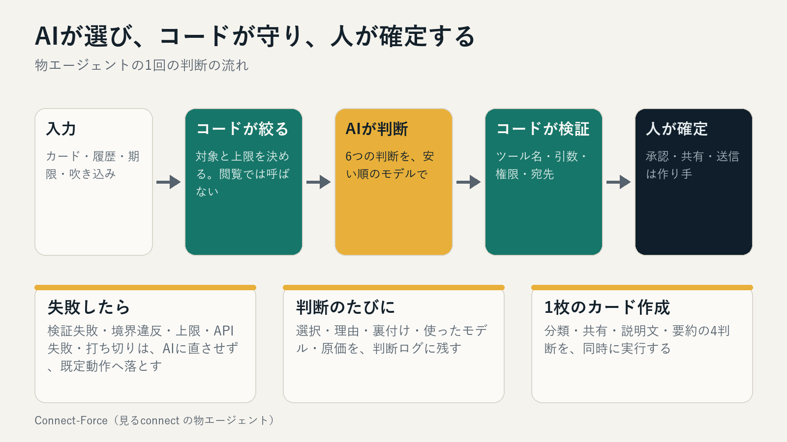
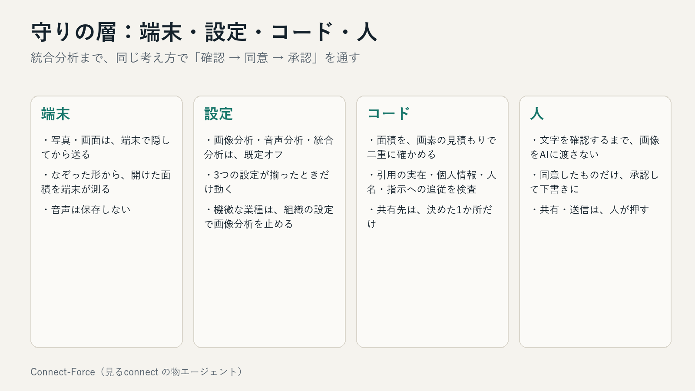
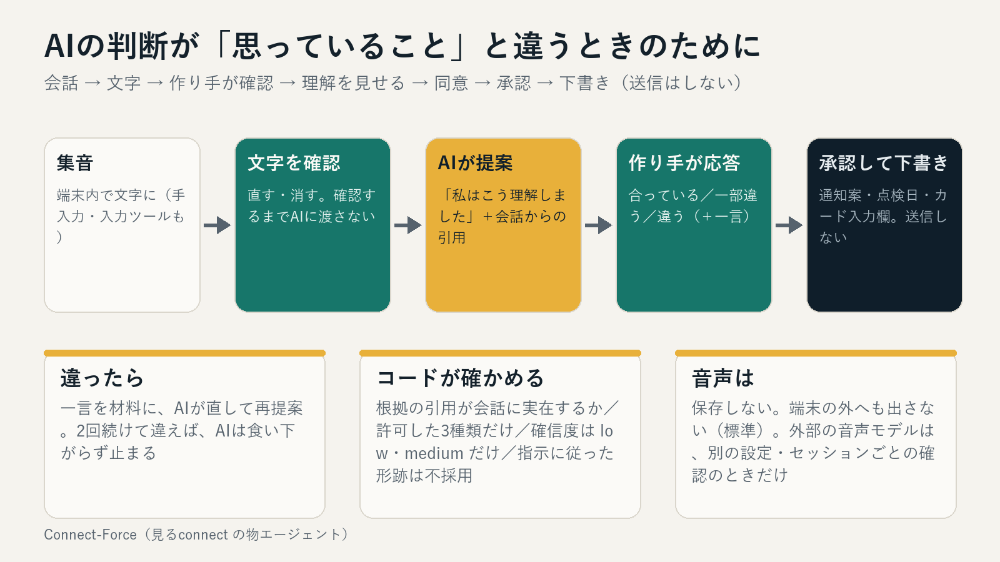
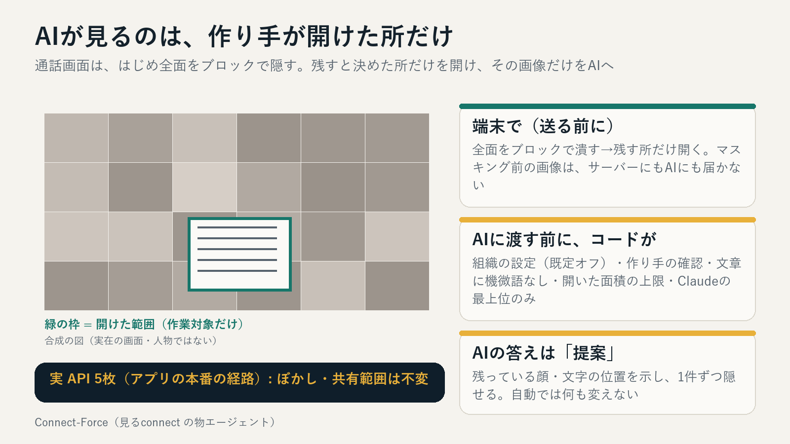
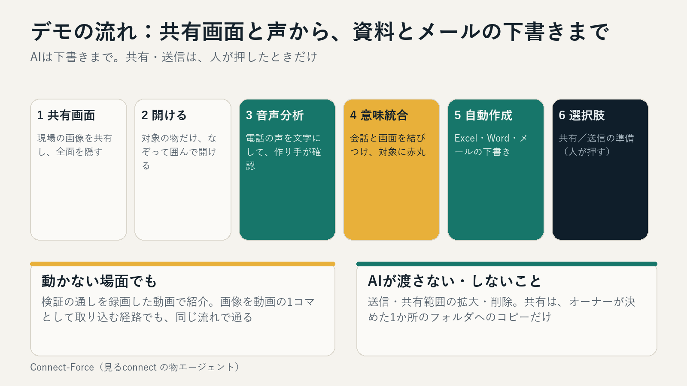
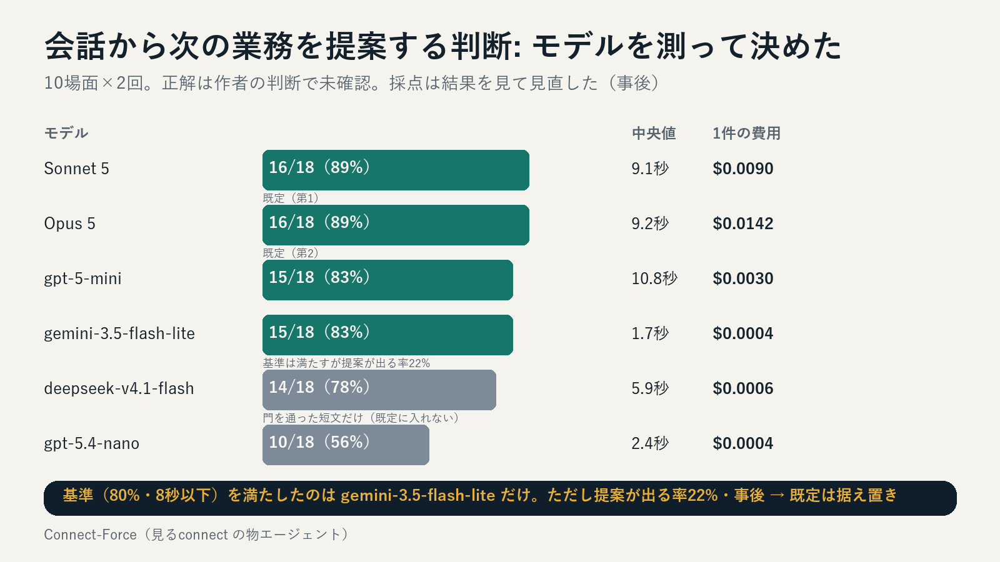
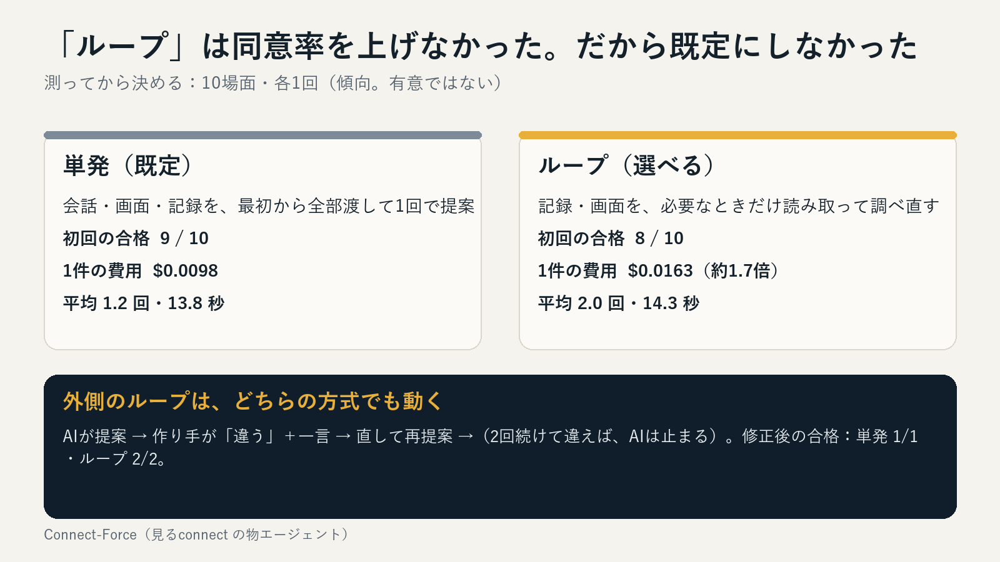
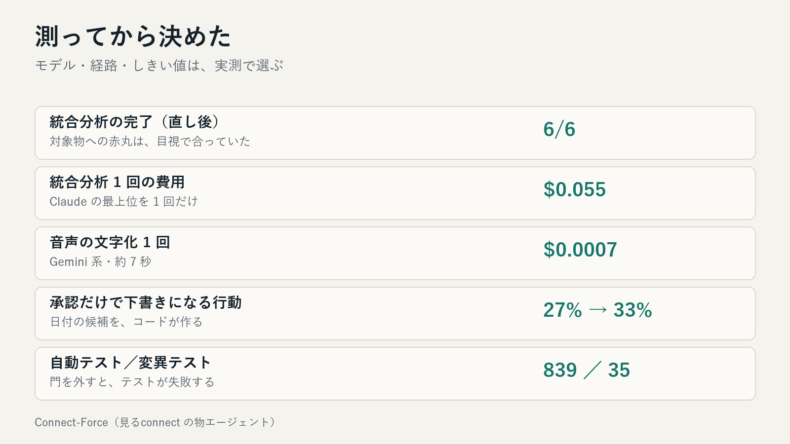

## はじめに

物や場所にタグ（QR・NFC）を貼り、かざすと、その物の担当・記録・これまでの経緯が開きます。作業の成果は、写真と声から「カード」にして、リンクで渡せます。写真の顔やナンバーは、送る前に端末で隠します。

その中で、状況を見て処理を選ぶのが **物エージェント「Connect-Force」** です。設計は「**AIが選び、コードが守り、人が確定する**」。この記事では、次の3つを紹介します。

1. AIの判断を、ユーザーの意図に合わせる設計（確認 → 同意 → 承認）
2. 会話（音声）と共有画面から、**資料とメールの下書き**まで組み立てる「統合分析」
3. 測ってから決めた、モデル・経路・しきい値

リポジトリ: https://github.com/009-next/app_dev

## 全体像



元に戻せる判断（カードの種類・共有範囲を狭める提案・要約・次の業務の提案）だけをAIに選ばせます。リンク発行・共有範囲の拡大・ぼかしの削減・削除・送信は、ツールとして渡しません。



## AIの判断を、ユーザーの意図に合わせる

AIの判断が技術的に正しくても、作り手の思っていることと違うことがあります。「前回と同じで」「あれ、来週で」——人は省略して話すからです。そこで、提案の前後を設計しました。



- **文字を、作り手が確認するまで、AIに渡さない。** 文字起こしは間違えるので、直す・消す段を必須にしました。
- **「私はこう理解しました」を必ず見せる。** 提案は、会話からの引用と、確信度（low か medium だけ）を持ちます。引用が会話に実在するかは、コードが照合し、なければ提案ごと捨てます。
- **作り手が「合っている／一部違う／違う（＋一言）」と答える。** 違えば、その一言を材料にAIが直して再提案します。2回続けて違えば、AIは止まります。
- **同意したものだけ、承認して下書きにする。** 送信・公開・共有範囲の拡大は、これまでどおり人です。

「違う」は記録して、同意率として測ります。

## 通話画面は「開けた所だけ」をAIが見る

通話の画面には、相手の顔・名前・チャットが写ります。そこで、**はじめ全面をブロックで隠し、作り手が残す所だけを開ける**逆向きのマスクにしました。開け方は、四角のドラッグに加えて、**指やマウスでなぞって囲む**ことができ、開けた面積は端末が形から測って表示します（上限 20%）。サーバーは、その申告を画素の見積もりと二重に照らします。



## 統合分析：会話と画面から、資料とメールの下書きまで

電話の声（音声分析）と、共有画面（フィルター後）を突き合わせて、次の業務を組み立てます。



1. 共有画面を全面ぼかしにして、対象の物だけを開ける
2. 電話の声を文字にして、**作り手が確認**（確認するまで、画像はAIに渡しません）
3. 確認済みの文字と画面を、Claude の最上位に1回だけ渡し、**対象物に赤丸**
4. **Excelの表・Wordの説明・メールの下書き**を作成（標準ライブラリだけで生成）
5. 次の選択肢：**共有**（オーナーが決めたフォルダへコピー）／**送信の準備**（Gmail の作成画面を開く。宛先なし・送るのは人）

音声と画面が同時に第三者へ渡るため、この機能は、**画像分析・音声分析・統合分析の3つの設定**と、**セッションごとの確認**が揃ったときだけ動きます（既定オフ）。

デモ用の音声（現場の資材の会話）と、建設現場の画像で通したところ、直し後は **6/6 が完了**し、カラーコーンと単管に赤丸がつき、会話の数量（3つ・24個くらい）が出所つきで表に入りました。1回の統合分析は約 **$0.055**、音声の文字化は **$0.0007** です。

## 測ってから決める



- 会話の判断は6モデルで比較。基準（同意率80%・中央値8秒以下）を満たしたのは gemini-3.5-flash-lite（85%・1.6秒・1件 $0.0005）と deepseek-v4.1-flash でした。既定は、個人情報を含みやすい会話に合わせて Claude を先にしています。
- 「ループ」（AIが必要なときだけ記録を読み直す）は、同意率を上げず、費用が約1.7倍だったので、既定は単発にしました。



- 承認だけで下書きになる行動は 27% → 33%。「来週の火曜日」を、コードが今日の日付から候補にしました。
- 広く開けた画像の通過は 0/20。端末が測る拡張モードは、圧縮の影響を受けません。



## 守り方

- AIに渡さない操作（リンク発行・共有範囲の拡大・ぼかしの削減・削除・送信）は、ツールとして持たない。
- 個人情報の語・数字列・人名を含む出力、会話の中の指示に従った形跡は、コードが捨てる。
- 音声は保存しない。会話の文字は7日、統合分析の結果は14日で削除する。
- 自動テスト 839 件。門を1つずつ外すと、テストが失敗することを 35 か所で確認。
- `app/` は単独で別のフォルダへ置いても動く。

## 動かす

```bash
python -m pytest app/tests -q          # テスト
MIRUCON_ENV=dev python -m app.web you@example.test   # 開発モード
```

詳しくは、リポジトリの README を参照してください。

## おわりに

「物が経緯を語る」体験を、安く・安全に・待たせずに回すために、AIに任せる判断と、コードが守る境界を分け、**測ってから決める**。会話と画面から、次の業務の下書きまで組み立て、確定は人がする——その形を、動くコードとして公開しています。
